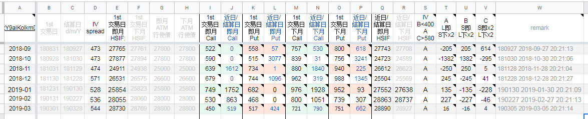
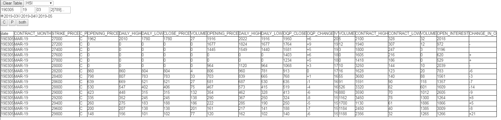
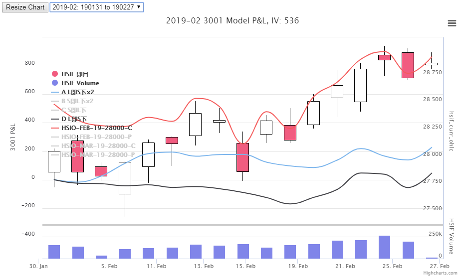
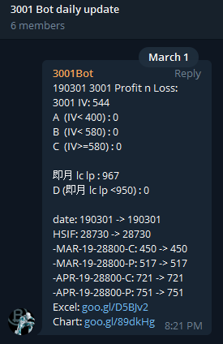

"HSIO/HSIF Query / 3001 Option Model  P/L" 

Feature:
1. Automaticaly download HKEX daily market report in from  [DAILY MARKET REPORT (LATEST)](https://www.hkex.com.hk/Market-Data/Statistics/Derivatives-Market/Daily-Market-Report-(Latest)?sc_lang=en), including Options and Futures.

2. Store data raw data in Google Drive (format in Zip)

3. Parse raw data using App Script

4. Provide google spreadsheets calculation for predefined Option Model (non-public)

5. Historial option query in [link](https://script.google.com/macros/s/AKfycbxKcVkaCnsGDO_0CB0uw8P_qMOqlsITNRTZeK0wHWoJRrC7NOWG/exec). This is the sample of search HSI option data on 03 Mar 2019, current Month contract, for Strike Price from 27000 to 2800

6. Chart view for P/L in [link](http://goo.gl/89dkHg)

7. Telegram daliy message update in telegram group (non-public)

